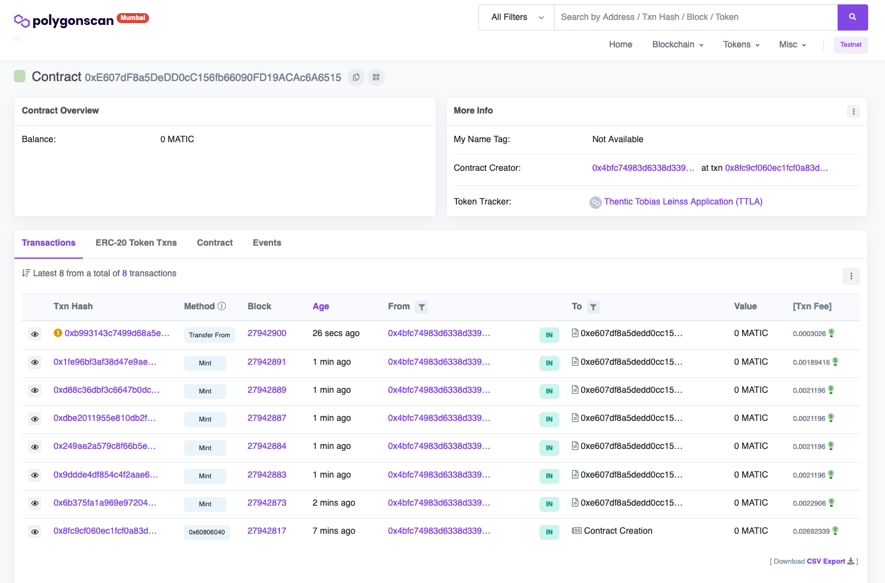

# Thentic APIs

## Install

`yarn`

## Run

`yarn start`

**Please comment in/out the functionality you want to run**

## Remarks

What could be implemented next is a cli tool instead having all in `main`.  
The current implementation is caused due to time restrictions.

## Polyscan



## Logs

```shell
Nft Contract successfully created! Please open following url with your browser.
Transaction Url: https://thentic.tech/request?id=xmD04lWaxIPAWIdM
Found following contracts:
[
  {
    chain_id: '80001',
    contract: '0xd38eb5b0ea067c6a229c9c5b87ac6682bd6b5dc0',
    name: 'Thentic Tobias Leinss Application',
    request_id: 'kceqgz0ljAt6HCnm',
    short_name: 'TTLA',
    status: 'success',
    transaction_pixel: "<iframe src='https://thentic.tech/request?id=kceqgz0ljAt6HCnm' width=1 height=1 scrolling=no frameborder=0></iframe>",
    transaction_url: 'https://thentic.tech/request?id=kceqgz0ljAt6HCnm'
  },
  {
    chain_id: '80001',
    contract: '0xe607df8a5dedd0cc156fb66090fd19acac6a6515',
    name: 'Thentic Tobias Leinss Application',
    request_id: 'xmD04lWaxIPAWIdM',
    short_name: 'TTLA',
    status: 'success',
    transaction_pixel: "<iframe src='https://thentic.tech/request?id=xmD04lWaxIPAWIdM' width=1 height=1 scrolling=no frameborder=0></iframe>",
    transaction_url: 'https://thentic.tech/request?id=xmD04lWaxIPAWIdM'
  }
]
Contract address is: 0xe607df8a5dedd0cc156fb66090fd19acac6a6515
```

```shell
Nft Data found in path: [
  {
    "name": "Multiavatar-0d3ea896b185a709ea.png",
    "description": "Multiavatar-0d3ea896b185a709ea.png",
    "image": "ipfs://QmRoLZm3kyDNjK7joNQepwVm56URE9kWSWXYzckNjXPvGx"
  },
  {
    "name": "Multiavatar-103f7ce10f7c76f74f.png",
    "description": "Multiavatar-103f7ce10f7c76f74f.png",
    "image": "ipfs://Qmcj35PdCz5FoZSLwFZKacezJmGQdMBPjoNxBeovFuGrk1"
  },
  {
    "name": "Multiavatar-107c6896b227ddcf32.png",
    "description": "Multiavatar-107c6896b227ddcf32.png",
    "image": "ipfs://QmV6TRU7T1w3urmeFvry7S6XfEExiRCGGvsrjZEfxsKopT"
  },
  {
    "name": "Multiavatar-9ae0fff72c5d9bba84.png",
    "description": "Multiavatar-9ae0fff72c5d9bba84.png",
    "image": "ipfs://QmRoLZm3kyDNjK7joNQepwVm56URE9kWSWXYzckNjXPvGx"
  },
  {
    "name": "Multiavatar-HesterVe.png",
    "description": "Multiavatar-HesterVe.png",
    "image": "ipfs://QmfVGDguVa3VBeSCJjwVDjyoh5EwD7i6CvbB4UHHRBo1Pd"
  }
]
```

```shell
Current existing Nfts in the given contract: [
  {
    "chain_id": "80001",
    "contract": "0xd38eb5b0ea067c6a229c9c5b87ac6682bd6b5dc0",
    "data": "{'name':'Multiavatar-0d3ea896b185a709ea.png','description':'Multiavatar-0d3ea896b185a709ea.png','image':'ipfs://QmRoLZm3kyDNjK7joNQepwVm56URE9kWSWXYzckNjXPvGx'}",
    "id": "1",
    "name": "Thentic Tobias Leinss Application",
    "request_id": "LeuB6qE3bj8bUpXP",
    "short_name": "TTLA",
    "status": "pending",
    "transaction_pixel": "<iframe src='https://thentic.tech/request?id=LeuB6qE3bj8bUpXP' width=1 height=1 scrolling=no frameborder=0></iframe>",
    "transaction_url": "https://thentic.tech/request?id=LeuB6qE3bj8bUpXP"
  },
  {
    "chain_id": "80001",
    "contract": "0xd38eb5b0ea067c6a229c9c5b87ac6682bd6b5dc0",
    "data": "{\"name\":\"Multiavatar-0d3ea896b185a709ea.png\",\"description\":\"Multiavatar-0d3ea896b185a709ea.png\",\"image\":\"ipfs://QmRoLZm3kyDNjK7joNQepwVm56URE9kWSWXYzckNjXPvGx\"}",
    "id": "2",
    "name": "Thentic Tobias Leinss Application",
    "request_id": "307ziCYK2LGPNfE4",
    "short_name": "TTLA",
    "status": "pending",
    "transaction_pixel": "<iframe src='https://thentic.tech/request?id=307ziCYK2LGPNfE4' width=1 height=1 scrolling=no frameborder=0></iframe>",
    "transaction_url": "https://thentic.tech/request?id=307ziCYK2LGPNfE4"
  },
  {
    "chain_id": "80001",
    "contract": "0xd38eb5b0ea067c6a229c9c5b87ac6682bd6b5dc0",
    "data": "'{\"name\":\"Multiavatar-0d3ea896b185a709ea.png\",\"description\":\"Multiavatar-0d3ea896b185a709ea.png\",\"image\":\"ipfs://QmRoLZm3kyDNjK7joNQepwVm56URE9kWSWXYzckNjXPvGx\"}'",
    "id": "3",
    "name": "Thentic Tobias Leinss Application",
    "request_id": "DdM0VI4wm27KmoPo",
    "short_name": "TTLA",
    "status": "pending",
    "transaction_pixel": "<iframe src='https://thentic.tech/request?id=DdM0VI4wm27KmoPo' width=1 height=1 scrolling=no frameborder=0></iframe>",
    "transaction_url": "https://thentic.tech/request?id=DdM0VI4wm27KmoPo"
  },
  {
    "chain_id": "80001",
    "contract": "0xd38eb5b0ea067c6a229c9c5b87ac6682bd6b5dc0",
    "data": "'{\"name\":\"Multiavatar-0d3ea896b185a709ea.png\",\"description\":\"Multiavatar-0d3ea896b185a709ea.png\",\"image\":\"ipfs://QmRoLZm3kyDNjK7joNQepwVm56URE9kWSWXYzckNjXPvGx\"}'",
    "id": "4",
    "name": "Thentic Tobias Leinss Application",
    "request_id": "EatWdABovjwqYMXx",
    "short_name": "TTLA",
    "status": "pending",
    "transaction_pixel": "<iframe src='https://thentic.tech/request?id=EatWdABovjwqYMXx' width=1 height=1 scrolling=no frameborder=0></iframe>",
    "transaction_url": "https://thentic.tech/request?id=EatWdABovjwqYMXx"
  },
  {
    "chain_id": "80001",
    "contract": "0xd38eb5b0ea067c6a229c9c5b87ac6682bd6b5dc0",
    "data": "'{\"name\":\"Multiavatar-0d3ea896b185a709ea.png\",\"description\":\"Multiavatar-0d3ea896b185a709ea.png\",\"image\":\"ipfs://QmRoLZm3kyDNjK7joNQepwVm56URE9kWSWXYzckNjXPvGx\"}'",
    "id": "5",
    "name": "Thentic Tobias Leinss Application",
    "request_id": "lxypeDbyki1yqpk2",
    "short_name": "TTLA",
    "status": "pending",
    "transaction_pixel": "<iframe src='https://thentic.tech/request?id=lxypeDbyki1yqpk2' width=1 height=1 scrolling=no frameborder=0></iframe>",
    "transaction_url": "https://thentic.tech/request?id=lxypeDbyki1yqpk2"
  },
  {
    "chain_id": "80001",
    "contract": "0xd38eb5b0ea067c6a229c9c5b87ac6682bd6b5dc0",
    "data": "'{\"name\":\"Multiavatar-0d3ea896b185a709ea.png\",\"description\":\"Multiavatar-0d3ea896b185a709ea.png\",\"image\":\"ipfs://QmRoLZm3kyDNjK7joNQepwVm56URE9kWSWXYzckNjXPvGx\"}'",
    "id": "6",
    "name": "Thentic Tobias Leinss Application",
    "request_id": "Nc9YCXMxnlT1uySw",
    "short_name": "TTLA",
    "status": "pending",
    "transaction_pixel": "<iframe src='https://thentic.tech/request?id=Nc9YCXMxnlT1uySw' width=1 height=1 scrolling=no frameborder=0></iframe>",
    "transaction_url": "https://thentic.tech/request?id=Nc9YCXMxnlT1uySw"
  },
  {
    "chain_id": "80001",
    "contract": "0xd38eb5b0ea067c6a229c9c5b87ac6682bd6b5dc0",
    "data": "'{\"name\":\"Multiavatar-0d3ea896b185a709ea.png\",\"description\":\"Multiavatar-0d3ea896b185a709ea.png\",\"image\":\"ipfs://QmRoLZm3kyDNjK7joNQepwVm56URE9kWSWXYzckNjXPvGx\"}'",
    "id": "7",
    "name": "Thentic Tobias Leinss Application",
    "request_id": "oH5amybpEowX2DQz",
    "short_name": "TTLA",
    "status": "pending",
    "transaction_pixel": "<iframe src='https://thentic.tech/request?id=oH5amybpEowX2DQz' width=1 height=1 scrolling=no frameborder=0></iframe>",
    "transaction_url": "https://thentic.tech/request?id=oH5amybpEowX2DQz"
  },
  {
    "chain_id": "80001",
    "contract": "0xd38eb5b0ea067c6a229c9c5b87ac6682bd6b5dc0",
    "data": "'{\"name\":\"Multiavatar-0d3ea896b185a709ea.png\",\"description\":\"Multiavatar-0d3ea896b185a709ea.png\",\"image\":\"ipfs://QmRoLZm3kyDNjK7joNQepwVm56URE9kWSWXYzckNjXPvGx\"}'",
    "id": "8",
    "name": "Thentic Tobias Leinss Application",
    "request_id": "ie0eMMl4akpA75Yi",
    "short_name": "TTLA",
    "status": "pending",
    "transaction_pixel": "<iframe src='https://thentic.tech/request?id=ie0eMMl4akpA75Yi' width=1 height=1 scrolling=no frameborder=0></iframe>",
    "transaction_url": "https://thentic.tech/request?id=ie0eMMl4akpA75Yi"
  },
  {
    "chain_id": "80001",
    "contract": "0xd38eb5b0ea067c6a229c9c5b87ac6682bd6b5dc0",
    "data": "'{\"name\":\"Multiavatar-0d3ea896b185a709ea.png\",\"description\":\"Multiavatar-0d3ea896b185a709ea.png\",\"image\":\"ipfs://QmRoLZm3kyDNjK7joNQepwVm56URE9kWSWXYzckNjXPvGx\"}'",
    "id": "9",
    "name": "Thentic Tobias Leinss Application",
    "request_id": "fRnmDjPeMgWBQOEQ",
    "short_name": "TTLA",
    "status": "pending",
    "transaction_pixel": "<iframe src='https://thentic.tech/request?id=fRnmDjPeMgWBQOEQ' width=1 height=1 scrolling=no frameborder=0></iframe>",
    "transaction_url": "https://thentic.tech/request?id=fRnmDjPeMgWBQOEQ"
  },
  {
    "chain_id": "80001",
    "contract": "0xd38eb5b0ea067c6a229c9c5b87ac6682bd6b5dc0",
    "data": "'{\"name\":\"Multiavatar-0d3ea896b185a709ea.png\",\"description\":\"Multiavatar-0d3ea896b185a709ea.png\",\"image\":\"ipfs://QmRoLZm3kyDNjK7joNQepwVm56URE9kWSWXYzckNjXPvGx\"}'",
    "id": "10",
    "name": "Thentic Tobias Leinss Application",
    "request_id": "ZGaFbnLywx58Sv6K",
    "short_name": "TTLA",
    "status": "success",
    "transaction_pixel": "<iframe src='https://thentic.tech/request?id=ZGaFbnLywx58Sv6K' width=1 height=1 scrolling=no frameborder=0></iframe>",
    "transaction_url": "https://thentic.tech/request?id=ZGaFbnLywx58Sv6K"
  },
  {
    "chain_id": "80001",
    "contract": "0xd38eb5b0ea067c6a229c9c5b87ac6682bd6b5dc0",
    "data": "'{\"name\":\"Multiavatar-0d3ea896b185a709ea.png\",\"description\":\"Multiavatar-0d3ea896b185a709ea.png\",\"image\":\"ipfs://QmRoLZm3kyDNjK7joNQepwVm56URE9kWSWXYzckNjXPvGx\"}'",
    "id": "11",
    "name": "Thentic Tobias Leinss Application",
    "request_id": "pFiefNsSwxxMlxVB",
    "short_name": "TTLA",
    "status": "pending",
    "transaction_pixel": "<iframe src='https://thentic.tech/request?id=pFiefNsSwxxMlxVB' width=1 height=1 scrolling=no frameborder=0></iframe>",
    "transaction_url": "https://thentic.tech/request?id=pFiefNsSwxxMlxVB"
  },
  {
    "chain_id": "80001",
    "contract": "0xd38eb5b0ea067c6a229c9c5b87ac6682bd6b5dc0",
    "data": "'{\"name\":\"Multiavatar-0d3ea896b185a709ea.png\",\"description\":\"Multiavatar-0d3ea896b185a709ea.png\",\"image\":\"ipfs://QmRoLZm3kyDNjK7joNQepwVm56URE9kWSWXYzckNjXPvGx\"}'",
    "id": "12",
    "name": "Thentic Tobias Leinss Application",
    "request_id": "GhuNbdKFgdF91bKV",
    "short_name": "TTLA",
    "status": "pending",
    "transaction_pixel": "<iframe src='https://thentic.tech/request?id=GhuNbdKFgdF91bKV' width=1 height=1 scrolling=no frameborder=0></iframe>",
    "transaction_url": "https://thentic.tech/request?id=GhuNbdKFgdF91bKV"
  },
  {
    "chain_id": "80001",
    "contract": "0xd38eb5b0ea067c6a229c9c5b87ac6682bd6b5dc0",
    "data": "{'name':'Multiavatar-0d3ea896b185a709ea.png','description':'Multiavatar-0d3ea896b185a709ea.png','image':'ipfs://QmRoLZm3kyDNjK7joNQepwVm56URE9kWSWXYzckNjXPvGx'}",
    "id": "5",
    "name": "Thentic Tobias Leinss Application",
    "request_id": "Ka5Tjkz5WAAVI7Vq",
    "short_name": "TTLA",
    "status": "success",
    "transaction_pixel": "<iframe src='https://thentic.tech/request?id=Ka5Tjkz5WAAVI7Vq' width=1 height=1 scrolling=no frameborder=0></iframe>",
    "transaction_url": "https://thentic.tech/request?id=Ka5Tjkz5WAAVI7Vq"
  },
  {
    "chain_id": "80001",
    "contract": "0xe607df8a5dedd0cc156fb66090fd19acac6a6515",
    "data": "'{\"name\":\"Multiavatar-0d3ea896b185a709ea.png\",\"description\":\"Multiavatar-0d3ea896b185a709ea.png\",\"image\":\"ipfs://QmRoLZm3kyDNjK7joNQepwVm56URE9kWSWXYzckNjXPvGx\"}'",
    "id": "13",
    "name": "Thentic Tobias Leinss Application",
    "request_id": "pXilLT5Z2OrHDS9H",
    "short_name": "TTLA",
    "status": "pending",
    "transaction_pixel": "<iframe src='https://thentic.tech/request?id=pXilLT5Z2OrHDS9H' width=1 height=1 scrolling=no frameborder=0></iframe>",
    "transaction_url": "https://thentic.tech/request?id=pXilLT5Z2OrHDS9H"
  }
]
```

```shell
Minted 5 Nft(s).
Open the following urls in your browser to sign the transactions
https://thentic.tech/request?id=aSsF0Mt2M8J9EnyD , https://thentic.tech/request?id=QgFHflwcfdn3Lpmp , https://thentic.tech/request?id=oV9jnLQkut2HAtgy , https://thentic.tech/request?id=kMH6Lf0Xjm1FHbyR , https://thentic.tech/request?id=NqMKZtQ4fOCB4W3d
```

```shell
Transfered Nft with Index 1.
Open the following urls in your browser to sign the transaction https://thentic.tech/request?id=riOzVs0hHrJi1SXi
```
